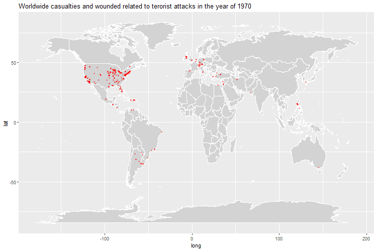

# 0. importing packages and data
here are the packages used in this report as well as importing the data

```{r, message=FALSE, warning=FALSE, results='hide'}
options(knitr.table.format = "html") 
library(tidyverse) # self explanatory
library(data.table) # self explanatory 
library(magrittr) # used for code altering
library(leaflet) # for interactive maps
library(maps) # for mapping
library(maptools) # for mapping leaflet maps
library(htmltools) # used for leaflet
library(rgdal)  # for READOGR command to read the spaital opbejts onto map
library(mapview) # to save images generated, in this script the code for saving has been invalidated with the use of #, if desired remove this
library(ggthemes) # to have pretty themes on our plots 
library(ggmap) # used for ggplot mapping
library(gganimate) #used for gif generation

#Removing non-wanted warnings 
options(warn=-1)

#importing data
df <- fread("../data/dataset.csv")

```


# 1. Sources 
```{r, message=FALSE, warning=FALSE, results='hide'}
#eval=TRUE, echo=FALSE, message=FALSE, warning=FALSE}
sources <- df %>% 
  count(dbsource) %>%
  transmute(Source = fct_reorder(dbsource, n), Frequency = n) %>%
  arrange(desc(Frequency))


plot <- ggplot(sources, aes(Source, Frequency))+
  geom_bar(stat = "identity", fill = "blue")+
  coord_flip()+
  labs(title="Attack frequency by source", x = "Source", y = "Amount")
plot(plot)
#ggsave("../images/Source.png")
```

# 2. Evolution of terrorism
```{r, message=FALSE, warning=FALSE, results='hide'}
plot <- df %>%
  count(iyear, attacktype1_txt) %>%
  mutate(Year = iyear, Type = reorder(attacktype1_txt, n), Frequency = n) %>%
  ggplot(aes(Year, Frequency, fill = Type)) +
  geom_bar(stat = "identity") +
  scale_fill_brewer(palette = "Paired") +
  theme(legend.position = "right",
        legend.text = element_text(size = 8),  # Adjust the font size of the legend text
        legend.title = element_text(size = 10)) +  # Adjust the font size of the legend title
  labs(title = "Terrorist Attacks time series by Type", fill = "Attack Type")


#image size
image_width <- 25  # Width in inches
image_height <- 10  # Height in inches

# Save the plot with the desired dimensions
#ggsave("../images/Evolution_of_terrorism.png", plot, width = image_width, height = image_height)

plot

```

# 3. Attacks by location
```{r, message=FALSE, warning=FALSE, results='hide'}
#convert to . instead of ,
df$longitude <- gsub(",", ".", df$longitude)
df$latitude <- gsub(",", ".", df$latitude)
df$longitude <- as.numeric(df$longitude)
df$latitude <- as.numeric(df$latitude)

#creating ggplot map
world <- map_data("world")
worldmap <- ggplot() +
  geom_map(data = world, 
           map = world, 
           aes(long, lat, map_id = region), 
           fill = "lightgray", 
           color = "white")+  
  scale_x_continuous(name = NULL, breaks = NULL)+
  scale_y_continuous(name = NULL, breaks = NULL)

#Creating differnet categories
lived <- filter(df, nkill == 0 | is.na(nkill))
killed <- filter(df, nkill > 0, nkill <=10)
killed10 <- filter(df, nkill > 10, nkill <=50)
killed50 <- filter(df, nkill > 50, nkill <=250)
killed250 <- filter(df, nkill > 250)
#plotting
worldmap +
  geom_point(data = lived, aes(longitude, latitude, color = "0"), size = 1, alpha = 0.15)+
  geom_point(data = killed, aes(longitude, latitude, color = "10"), size = 1.25, alpha = 0.15)+
  geom_point(data = killed10, aes(longitude, latitude, color = "50"), size = 1.5, alpha = 0.15)+
  geom_point(data = killed50, aes(longitude, latitude, color = "250"), size = 1.75, alpha = 0.25)+
  geom_point(data = killed250, aes(longitude, latitude, color = "above"), size = 2, alpha = 1.00)+
  scale_color_manual(name = "Killed", #dont ask me why but for some reason ggplot is bugged and switches orange and yellow around...
                     values = c("0" = "black", "10" = "green", "50" = "orange", "250" = "yellow", "above" = "red"), 
                     labels = c("None", "1 - 10", "11 - 50", "51 - 250", "over 250"))+
  guides(color = guide_legend(override.aes = list(size = 5)))+
  labs(title = "attacks based on amount killed, transparency in colour is based on frequence")
#ggsave("../images/killed_based_on_frequency.png")


```

# 4. Gif showing yearly evolution of casualties and wounded
```{r, message=FALSE, warning=FALSE, results='hide'}
# Obtaining the data for plotting
giffer <- df %>%
  transmute(Year = iyear, longitude = longitude, latitude = latitude, Killed = nkill, Wounded = nwound)

# Creating base layer plus the title
plot <- ggplot() +
  borders("world", colour = "white", fill = "lightgray") +
  labs(title = "Worldwide casualties and wounded related to terorist attacks in the year of {closest_state}")

# Adding the points layer (frame argument for the animation)
plot <- plot + 
  transition_states(Year, transition_length = 1, state_length = 1) +
  geom_point(data = giffer, 
             aes(x = longitude, y = latitude, size = Killed), 
             color = "red", 
             alpha = 0.35) +
  theme(legend.position = "none")

# Animating
animate(plot, renderer = gifski_renderer(), width = 750, height = 500, fps = 2)
anim_save("giffy.gif", title_frame = TRUE)
plot
```



# 5. Chlorograph map displaying amount of attacks
```{r, message=FALSE, warning=FALSE}
world_spdf <- readOGR(dsn=path.expand("../data/world_shape_file"), layer="TM_WORLD_BORDERS_SIMPL-0.3", verbose=FALSE)

#get number of attacks by country 
attacks <- df[, .N, by = country_txt][, country_txt := country_txt]

#Need to fix missmatches between the dfist dataset and the world_sdfp
attacks[, country_txt := gsub("Slovak Republic", "Slovakia", country_txt)]
attacks[, country_txt := gsub('Bosnia-Herzegovina', 'Bosnia and Herzegovina', country_txt)]
attacks[, country_txt := gsub("People's Republic of the Congo", "Congo", country_txt)]
attacks[, country_txt := gsub("North Korea", "Korea, Democratic People's Republic of", country_txt)]
attacks[, country_txt := gsub("South Korea", "Korea, Republic of", country_txt)]
attacks[, country_txt := gsub("Tanzania", "United Republic of Tanzania", country_txt)]
attacks[, country_txt := gsub("Libya", "Libyan Arab Jamahiriya", country_txt)]
attacks[, country_txt := gsub("Vietnam", "Viet Nam", country_txt)]
attacks[, country_txt := gsub("Laos", "Lao People's Democratic Republic", country_txt)]
attacks[, country_txt := gsub("Myanmar", "Burma", country_txt)]
attacks[, country_txt := gsub("Brunei", "Brunei Darussalam", country_txt)]
attacks[, country_txt := gsub("East timor", "Timor-Leste", country_txt)]
attacks[, country_txt := gsub("Iran", "Iran (Islamic Republic of)", country_txt)]
attacks[, country_txt := gsub("Syria", "Syrian Arab Republic", country_txt)]
attacks[, country_txt := gsub("Macedonia", "The former Yugoslav Republic of Macedonia", country_txt)]
attacks[, country_txt := gsub("Moldova", "Republic of Moldova", country_txt)]
attacks[, country_txt := gsub("Ivory Coast", "Cote d'Ivoire", country_txt)]

#colour palette creation
dd <- merge(world_spdf, attacks, by.x = "NAME", by.y = "country_txt")

# create the choropleth palette
bins <- c(0, 50, 100, 500, 1000, 2000, 5000, 10000, 30000)
pal <- colorBin("PuBuGn", domain = dd$N, bins = bins)

# Create the map object
map <- leaflet(world_spdf) %>%
  addProviderTiles("CartoDB.Positron")

# create the country labels
labels <- sprintf(
    "%s</br>Number of attacks: %g", dd$NAME, dd$N) %>%
    lapply(HTML)
dd$N[is.na(dd$N)] <- 0

# Add the choropleth layer
map <- map %>%
  addPolygons(
    fillColor = ~pal(dd$N),
    weight = 1,
    opacity = 1,
    color = "#666",
    fillOpacity = 0.8,
    highlight = highlightOptions(
      weight = 2,
      color = "black",
      fillOpacity = 0.9,
      bringToFront = TRUE),
    label = labels) %>%
 addLegend(pal = pal, values = ~ dd$N, opacity = 0.7, title = NULL, position = 'bottomright')

#display and save map
map
#mapshot(map, file = "../images/choroplethbasic.png")


```

# 6. Chlorograph map based on popluation
```{r, message=FALSE, warning=FALSE}
#world_spdf <- readOGR(dsn=path.expand("../data/world_shape_file"), layer="TM_WORLD_BORDERS_SIMPL-0.3", verbose=FALSE)
#world_spdf@data$POP2005[ which(world_spdf@data$POP2005 == 0)] = NA
dd@data$POP2005 <- as.numeric(as.character(dd@data$POP2005)) 
#dd@data$N <- as.numeric(as.character(dd@data$N))
dd@data$atkprperson <- dd@data$N/dd@data$POP2005*10000

# create the choropleth palette
bins <- c(0, 0.1, 0.25, 0.5, 0.75, 1, 2, 4, 6, Inf)
pal <- colorBin("YlOrRd", domain = dd$atkprperson, bins = bins)

# Create the map object
map <- leaflet(world_spdf) %>%
  addProviderTiles("CartoDB.Positron")

# create the country labels
labels <- sprintf(
    "%s</br>Attacks per 10000 people: %g", dd$NAME, round(dd$atkprperson, 2)) %>%
    lapply(HTML)

# Add the choropleth layer
map <- map %>%
  addPolygons(
    fillColor = ~pal(dd$atkprperson),
    weight = 1,
    opacity = 1,
    color = "#666",
    fillOpacity = 0.8,
    highlight = highlightOptions(
      weight = 2,
      color = "black",
      fillOpacity = 0.9,
      bringToFront = TRUE),
    label = labels) %>%
 addLegend(pal = pal, values = ~ dd$atkprperson, opacity = 0.7, title = NULL, position = 'bottomright')

#display and save map
map
#mapshot(map, file = "../images/attacksby10000.png")


```

# 7. Chloropgraph map showing killed by country
```{r, message=FALSE, warning=FALSE}
killed <- df %>%
  group_by(country_txt) %>%
  summarise(Killed = sum(nkill, na.rm = T)) %>%
  arrange(order(country_txt))

killed$country_txt <- str_replace(killed$country_txt,"Slovak Republic", "Slovakia")
killed$country_txt <- str_replace(killed$country_txt,"Bosnia-Herzegovina", "Bosnia and Herzegovina")
killed$country_txt <- str_replace(killed$country_txt,"People's Republic of the Congo", "Congo")
killed$country_txt <- str_replace(killed$country_txt,"North Korea", "Korea, Democratic People's Republic of")
killed$country_txt <- str_replace(killed$country_txt,"South Korea", "Korea, Republic of")
killed$country_txt <- str_replace(killed$country_txt,"Tanzania", "United Republic of Tanzania")
killed$country_txt <- str_replace(killed$country_txt,"Libya", "Libyan Arab Jamahiriya")
killed$country_txt <- str_replace(killed$country_txt,"Vietnam", "Viet Nam")
killed$country_txt <- str_replace(killed$country_txt,"Laos", "Lao People's Democratic Republic")
killed$country_txt <- str_replace(killed$country_txt,"Myanmar", "Burma")
killed$country_txt <- str_replace(killed$country_txt,"Brunei", "Brunei Darussalam")
killed$country_txt <- str_replace(killed$country_txt,"East timor", "Timor-Leste")
killed$country_txt <- str_replace(killed$country_txt,"Iran", "Iran (Islamic Republic of)")
killed$country_txt <- str_replace(killed$country_txt,"Syria", "Syrian Arab Republic")
killed$country_txt <- str_replace(killed$country_txt,"Macedonia", "The former Yugoslav Republic of Macedonia")
killed$country_txt <- str_replace(killed$country_txt,"Moldova", "Republic of Moldova")
killed$country_txt <- str_replace(killed$country_txt,"Ivory Coast", "Cote d'Ivoire")

dd <- merge(world_spdf, killed, by.x = "NAME", by.y = "country_txt")

# create the choropleth palette
bins <- c(0, 100, 500, 1000, 2000, 5000, 10000, 20000, 40000, 80000, Inf)
pal <- colorBin("YlOrRd", domain = dd$Killed, bins = bins)

# Create the map object
map <- leaflet(world_spdf) %>%
  addProviderTiles("CartoDB.Positron")

# create the country labels
labels <- sprintf(
    "%s</br>People killed: %g", dd$NAME, dd$Killed) %>%
    lapply(HTML)

# Add the choropleth layer
map <- map %>%
  addPolygons(
    fillColor = ~pal(dd$Killed),
    weight = 1,
    opacity = 1,
    color = "#666",
    fillOpacity = 0.8,
    highlight = highlightOptions(
      weight = 2,
      color = "black",
      fillOpacity = 0.9,
      bringToFront = TRUE),
    label = labels) %>%
 addLegend(pal = pal, values = ~ dd$killed, opacity = 0.7, title = NULL, position = 'bottomright')

#display and save map
map
#mapshot(map, file = "../images/choroplethkilled.png")


```

# 8. Chlorograph map showing killed pr 10000 people
```{r, message=FALSE, warning=FALSE}
#world_spdf <- readOGR(dsn=path.expand("../data/world_shape_file"), layer="TM_WORLD_BORDERS_SIMPL-0.3", verbose=FALSE)
dd@data$POP2005 <- as.numeric(as.character(dd@data$POP2005)) 
dd@data$Killed <- as.numeric(as.character(dd@data$Killed))
dd@data$killedprperson <- dd@data$Killed/dd@data$POP2005*10000

# create the choropleth palette
bins <- c(0, 0.05, 0.1, 0.5, 1, 2, 5, 10, 15, 25, Inf)
pal <- colorBin("PuBuGn", domain = dd$killedprperson, bins = bins)

# Create the map object
map <- leaflet(world_spdf) %>%
  addProviderTiles("CartoDB.Positron")

# create the country labels
labels <- sprintf(
    "%s</br>People killed pr 10000 people: %g", dd$NAME, dd$killedprperson) %>%
    lapply(HTML)

# Add the choropleth layer
map <- map %>%
  addPolygons(
    fillColor = ~pal(dd$killedprperson),
    weight = 1,
    opacity = 1,
    color = "#666",
    fillOpacity = 0.8,
    highlight = highlightOptions(
      weight = 2,
      color = "black",
      fillOpacity = 0.9,
      bringToFront = TRUE),
    label = labels) %>%
 addLegend(pal = pal, values = ~ dd$killedprperson, opacity = 0.7, title = NULL, position = 'bottomright')
#display and save map
map
#mapshot(map, file = "../images/killedpr10000.png")

```

# 9. Chlorograph map displaying "succes_rate" based on country
```{r, message=FALSE, warning=FALSE}
success <- df %>%
  group_by(country_txt) %>%
  summarise(success_rate = mean(success, na.rm = T)) %>%
  arrange(order(country_txt))

success$country_txt <- str_replace(success$country_txt,"Slovak Republic", "Slovakia")
success$country_txt <- str_replace(success$country_txt,"Bosnia-Herzegovina", "Bosnia and Herzegovina")
success$country_txt <- str_replace(success$country_txt,"People's Republic of the Congo", "Congo")
success$country_txt <- str_replace(success$country_txt,"North Korea", "Korea, Democratic People's Republic of")
success$country_txt <- str_replace(success$country_txt,"South Korea", "Korea, Republic of")
success$country_txt <- str_replace(success$country_txt,"Tanzania", "United Republic of Tanzania")
success$country_txt <- str_replace(success$country_txt,"Libya", "Libyan Arab Jamahiriya")
success$country_txt <- str_replace(success$country_txt,"Vietnam", "Viet Nam")
success$country_txt <- str_replace(success$country_txt,"Laos", "Lao People's Democratic Republic")
success$country_txt <- str_replace(success$country_txt,"Myanmar", "Burma")
success$country_txt <- str_replace(success$country_txt,"Brunei", "Brunei Darussalam")
success$country_txt <- str_replace(success$country_txt,"East timor", "Timor-Leste")
success$country_txt <- str_replace(success$country_txt,"Iran", "Iran (Islamic Republic of)")
success$country_txt <- str_replace(success$country_txt,"Syria", "Syrian Arab Republic")
success$country_txt <- str_replace(success$country_txt,"Macedonia", "The former Yugoslav Republic of Macedonia")
success$country_txt <- str_replace(success$country_txt,"Moldova", "Republic of Moldova")
success$country_txt <- str_replace(success$country_txt,"Ivory Coast", "Cote d'Ivoire")

dd <- merge(world_spdf, success, by.x = "NAME", by.y = "country_txt")

# create the choropleth palette
bins <- c(0, 0.2, 0.4, 0.6, 0.8, 1)
pal <- colorBin("PuBuGn", domain = dd$success_rate, bins = bins)

# Create the map object
map <- leaflet(world_spdf) %>%
  addProviderTiles("CartoDB.Positron")

# create the country labels
labels <- sprintf(
    "%s</br>Sucess rate: %g", dd$NAME, dd$success_rate) %>%
    lapply(HTML)

# Add the choropleth layer
map <- map %>%
  addPolygons(
    fillColor = ~pal(dd$success_rate),
    weight = 1,
    opacity = 1,
    color = "#666",
    fillOpacity = 0.8,
    highlight = highlightOptions(
      weight = 2,
      color = "black",
      fillOpacity = 0.9,
      bringToFront = TRUE),
    label = labels) %>%
 addLegend(pal = pal, values = ~ dd$success_rate, opacity = 0.7, title = NULL, position = 'bottomright')

#display and save map
map
#mapshot(map, file = "../images/succes_rate.png")


```

# 10. Interactive leaflet map, (sadly cluttering)
```{r, message=FALSE, warning=FALSE}
# Round longitude to one decimal place (because leaflet round function prefers numeric and our dataset is with)
df$longitude <- gsub(",", ".", df$longitude)


# Round latitude to one decimal place
df$latitude <- gsub(",", ".", df$latitude)


# Convert to numeric
df$longitude <- as.numeric(df$longitude)
df$latitude <- as.numeric(df$latitude)

# paste year, month, and day into a single date column
df[, date := paste(iyear, imonth, iday, sep = '-')]

# setting blank values to NA
df[location == "", location := "NA"]
df[motive == "", motive := "NA"]
df[attacktype1_txt== "", motive := "NA"]
df[targtype1_txt== "", targtype1_txt := "NA"]

# create the labels
labels <- sprintf(
  "Date: %s</br>City: %s</br>Location: %s</br>Motive: %s</br>Type: %s</br>Target: %s</br>killed: %s",
  df$date, df$city, df$location, df$motive, df$attacktype1_txt, df$targtype1_txt, df$nkill
) %>%
lapply(HTML)


df %>%
    leaflet() %>%
    addTiles() %>%
    addCircleMarkers(~ longitude, ~ latitude,
    radius = 4,
    label = labels,
    clusterOptions = markerClusterOptions()
    )

```


